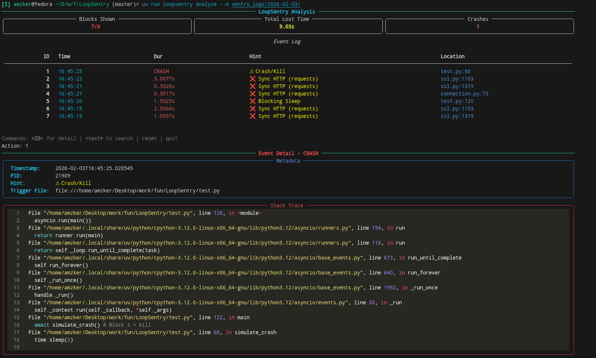

# LoopSentry

### **Asyncio Event Loop Blockers Detector & Analyzer**
- utility for detecting blocking calls in asyncio event loops



### **Installation**

```bash
uv add loopsentry
```
pip way

```bash
pip install loopsentry
```

### **Usage**
1. Basic Usage

```python
import asyncio
from loopsentry import LoopSentry

async def main():
    # start monitoring (default threshold: 0.1s) ie: if blocks is >= 0.1 , it is logged
    sentry = LoopSentry(threshold=0.1)
    sentry.start()

    print("Running...")
    ... # rest of your application

if __name__ == "__main__":
    asyncio.run(main())
```

2. Use inside Uvicorn/gunicorn workers in fastapi
- you need to put it inside a `lifespan` context manager , so if you use multiple workers eachh gets their own LoopSentry instance

```python
from contextlib import asynccontextmanager
from fastapi import FastAPI
from loopsentry import LoopSentry

@asynccontextmanager
async def lifespan(app: FastAPI):
    sentry = LoopSentry()
    sentry.start()
    yield

app = FastAPI(lifespan=lifespan)

@app.get("/")
async def root():
    return {"message": "I am being monitored!"}
```

### **Log Analysis**

```bash
uv run loopsentry analyze -d log_directory
```
NOTE: if you used pip to install then

```bash
loopsentry analyze -d log_directory
```